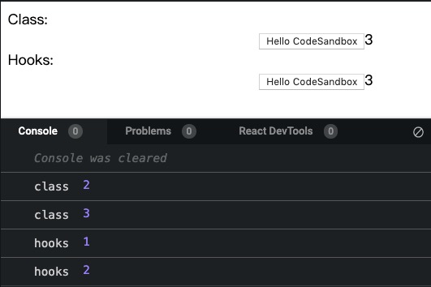

首先看下[官网对 useLayoutEffect 的解释](https://reactjs.org/docs/hooks-reference.html#uselayouteffect)。

作用其实和`useEffect`差不多，只是`useLayoutEffect`是在 DOM 变化后同步触发的（与`componentDidMount`和`componentDidUpdate`触发时机一致）。可以使用`useLayoutEffect`在 DOM 变化后同步获取布局。在`useLayoutEffect`内部的更新会在 DOM 更新完成后立即执行，但是会在浏览器绘制前进行。

> 使用`useEffect`可以避免不必要的渲染阻塞。（也是跟`componentDidMount`和`componentDidUpdate`区别之一）。

更新过程大致如下：

| `useEffect`                   | `useLayoutEffect`                         |
| ----------------------------- | ----------------------------------------- |
| 触发一次渲染                  | 触发一次渲染                              |
| React 渲染组件（调用 render） | React 渲染组件（调用 render）             |
| 屏幕更新                      | 调用`useLayoutEffect`，React 会等它执行完 |
| 调用`useEffect`               | 屏幕更新                                  |

可以看[这个例子](https://codesandbox.io/s/rough-sound-b1vmd)

使用`useEffect`的话在刷新的时候会看到`marginLeft`生效的闪烁，但是`useLayoutEffect`就木有。


## 关于`useState`和`setState`的区别

### 首先，Hooks 是闭包啊

见[这个例子](https://codesandbox.io/s/small-field-4vjut)

我们都知道，`setState`是异步更新的，但是在异步代码，如`setTimeout`中：

```js
// ...
state = { count: 1 };

// ...
setTimeout(() => {
  this.setState({ count: this.state.count + 1 });
  console.log("class", this.state.count);
}, 0);
```

直接打印就是更新完的值了！但是 Hooks 中就不一样了！打印出来的还是上一次值，这是因为 Hooks 是闭包啊！！



### 其次，hooks 内部会进行`Object.is`的比较

又是一个[例子](http://codesandbox.io/s/hungry-moon-7e6ex)！

首先要说这不是推荐的写法，因为违反了源数据不可变。

但是在点击按钮的时候会发现每次点击"class rendered"都会被打印出来，"hooks rendered"却没有打印，且页面也没有更新，是因为 hooks 内部进行了`Object.is`的浅比较啊，认为数据源木有变化，但是通过打印能看出数据已经变化啦。


## 参考资料

- [useEffect-vs-useLayoutEffect](https://daveceddia.com/useeffect-vs-uselayouteffect/)
