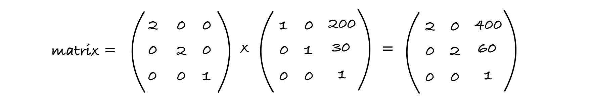
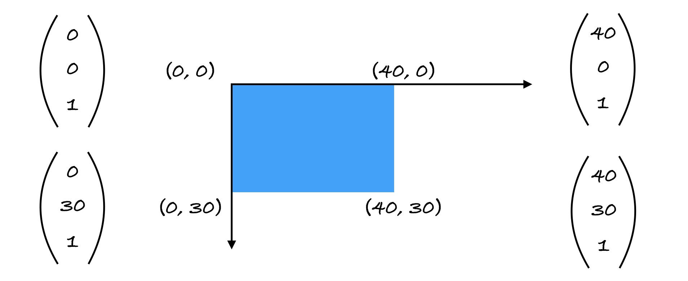

其实就是[用`scale`实现缩放](/daily/18-scale/)的时候，想修改他的`translateX`和`translateY`来做一些拖拽的操作时，发现计算出来的距离都会受到缩放比例的影响，就小小的研究一下是什么鬼哦。

<!--more-->

首先要知道的是`transform`不是直接修改元素的尺寸，而是会给目标元素创建一个局部坐标，可以看下这篇[文章](https://www.impressivewebs.com/dom-element-dimensions-and-css-transforms/)，大致意思是`transform`之后拿元素的`offsetWidth`和`offsetHeight`都还是原来的值，不过用`getBoundingClientRect`可以拿到`transform`后的。

如[这个例子](https://codesandbox.io/s/transform-matrix-luedu)

```js
const setStyle = ({ scaleRate, translateX, translateY }) => {
  const scale = scaleRate * scaleRef.current;
  if (nodeRef.current) {
    // nodeRef.current.style.transform = `scale(${scale}) translate(${translateX}px, ${translateY}px)`;  -- 1
    // nodeRef.current.style.transform = `scale(${scale}) translate(${translateX / scale}px, ${translateY / scale}px)`; -- 2
    nodeRef.current.style.transform = `matrix(${scale}, 0, 0, ${scale}, ${translateX}, ${translateY})`;
  }
  // ...
};
```

当使用第 1 行的设置方法时会发现结果并不理想。那问题来了，为什么要除以`scale`呢！

具体的 transform 大致对应矩阵中的这些项：


这些项相乘得到一个 matrix 矩阵，原元素的四角坐标经过 matrix 变换(矩阵相乘)，从而得到变换后的四角坐标。

那么 matrix 是怎么算出来的呢！比如

```css
transform: scale(2) translate(200px, 30px);
```



当前的 matrix 是

$$
\begin{pmatrix}
2 & 0 & 400
\newline
0 & 2 & 60
\newline
0 & 0 & 1
\end{pmatrix}
$$

2D 矩阵的对应 matrix：`matrix(2, 0, 0, 2, 400, 60)`。

那么坐标系怎么运用这个变换呢！比如一个这样的元素：



四个角坐标分别与 matrix 相乘会得到最终在坐标系中的位置（以(40, 30)为例）：


最后的坐标会是(400, 60)，(480, 60)，(480, 120)，(400, 120)。

会发现其实 CSS 中`transform`属性的`scale`和`translate`针对的就是`matrix`的第 1、4、5 和 6 项，其中 1、4 对应的是对角线上的`scale`，5 和 6 分别对应`translate`的距离，当放大了一倍之后在坐标系中的移动的距离`(400, 60)`会是原来`transform: translate(200, 30)`的 2 倍。所以如果当缩放过后针对当前元素使用`translate`都是需要除以缩放比例的，不想除的话就可以用`transform: matrix`~~

## 参考资料

- [transform spec](https://www.w3.org/TR/css-transforms-1/#transform-rendering)
- [css3 matrix transform for the mathematically challenged](https://www.useragentman.com/blog/2011/01/07/css3-matrix-transform-for-the-mathematically-challenged/)
- [scale 和 translate 的顺序](https://computergraphics.stackexchange.com/questions/4193/what-is-the-correct-order-of-transformations-scale-rotate-and-translate-and-why)
- [stackOverflow-css transform scale does not change dom size](https://stackoverflow.com/questions/32835144/css-transform-scale-does-not-change-dom-size)
- [dom element dimensions and css transforms](https://www.impressivewebs.com/dom-element-dimensions-and-css-transforms/)
