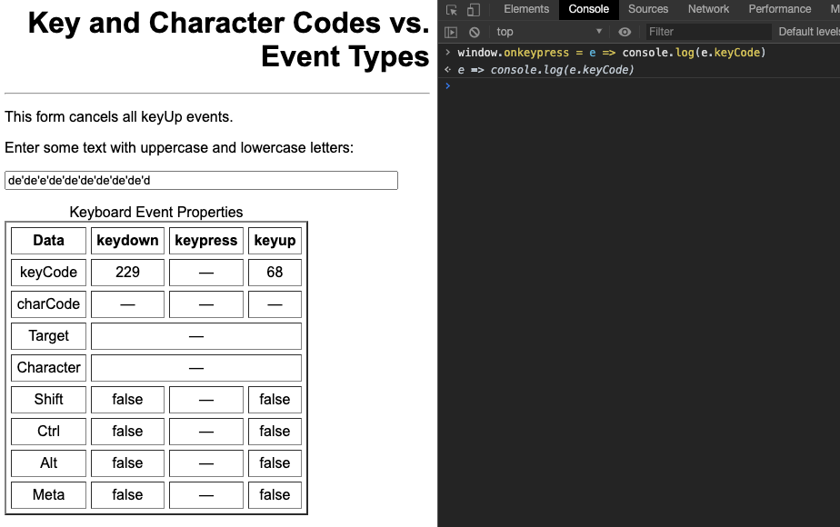
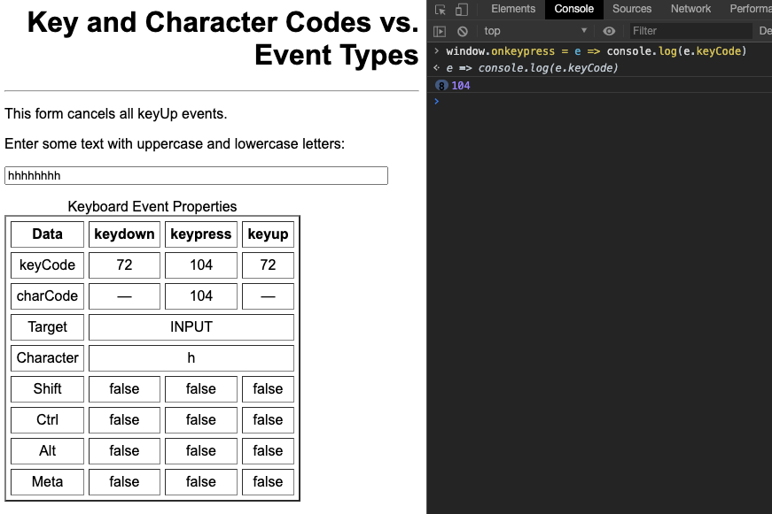
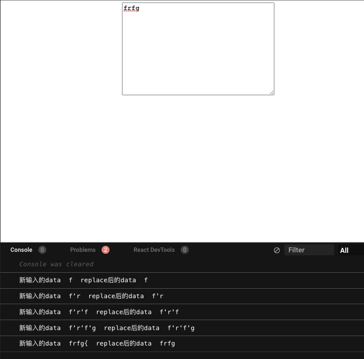
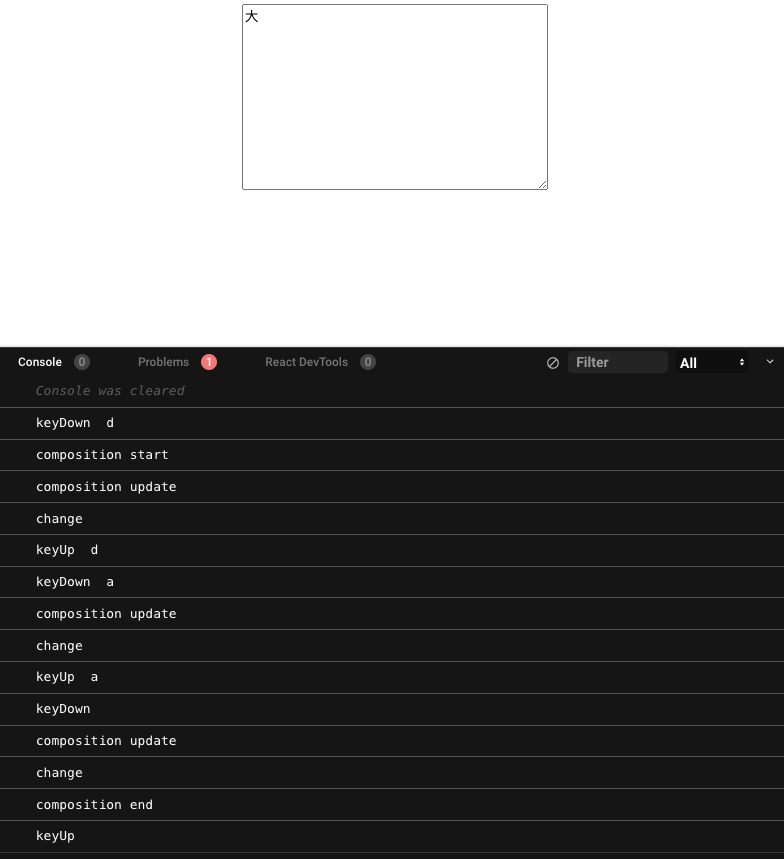
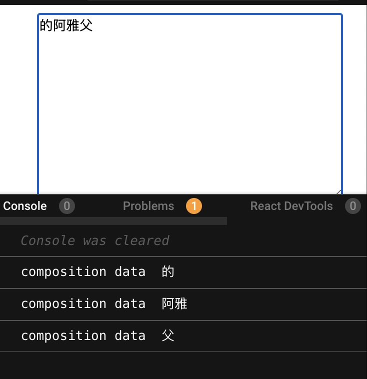
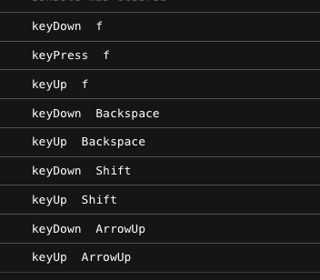

背景是业务中的一个文本框应该禁止「输入」 `{` 和 `}`。但是不能直接对 `value` 进行`replace`操作。

<!--more-->

## keydown 和 keypress

因为这个输入框中存在点击文字插入的“变量体”，类似`{变量名}` 。添加、删除都会作为一个整体。原以为 `onKeyDown` 的时候禁用掉左右括号的输入就可以解决，但是在 windows 上使用中文输入法时还是可以输进去，甚至搜狗输入法还会在按下 `{` 的时候自动补齐右括号，简直不要太人性化...

```js
const bracketCodeSet = new Set([219, 221]);

const handleKeyDown = (e) => {
  const keyCode = e.keyCode;
  if (e.shiftKey && bracketCodeSet.has(keyCode)) {
    e.preventDefault();
  }
};
```

debug 的时候发现中文输入时，左右括号的 `keyCode` 并不是 219 和 221，而是 229，而且不仅仅括号是 229，凡是中文输入时 keyDown 的键值都是 229。

为什么是 229 呢，[W3C 标准](https://lists.w3.org/Archives/Public/www-dom/2010JulSep/att-0182/keyCode-spec.html#fixed-virtual-key-codes)可以看到：

> If an Input Method Editor is processing key input and the event is keydown, return 229.

翻译过来就是 keydown 事件如果输入法编辑器正在处理键盘输入，此时的键值则返回 229。可在[这里](https://www.w3.org/2002/09/tests/keys-cancel2.html)分中文和英文输入输入 h，会获取到以下值：

| h         | keydown | keypress | keyup |
| --------- | ------- | -------- | ----- |
| 英文      |         |          |       |
| keyCode   | 72      | 104      | 72    |
| charCode  | --      | 104      | --    |
| character |         | h        |       |
| 中文      |         |          |       |
| keyCode   | 229     | --       | 72    |
| charCode  | --      | --       | --    |
| character |         | --       |       |

`keyCode` 和 `charCode` 的区别就是一个是 keyboard codes（键盘的键对应的值）一个是 character codes（Unicode 字符），对于非字符值比如上下左右键，是没有 `charCode` 属性的。

那为什么 keypress 和 keydown 的 `keyCode` 不一样呢！是因为 `keyCode` 是键值，但是 Unicode 码其实是分字母大小写的，当输入大写的时候就一样了，所以对于字母的处理来说，keypress 的 `keyCode` 较为准确。

既然所有中文输入在 keyDown 阶段 `keyCode` 都是 229，意味着凡是中文输入法的值，按照 `keyCode` 来识别左右括号再阻止默认输入行为是没有用的。

那么考虑到输入框的事件顺序：

> onkeydown -> onkeypress -> onkeyup -> onchange

keypress 阶段也可以阻止默认行为，但是中文输入不会触发 keypress：





所以想在 `keydown` 和 `keypress` 阶段通过 `e.preventDefault()` 来控制输入的想法应该是不行了。。。

## onchange

于是在 `onChange` 的时候对插入的字符串进行了一波操作，具体方法是拿到最新的 `e.target.value` 和新输入的值 `e.nativeEvent.data` ，对新输入的值进行左右括号的 `replace` 操作随后再对 `e.target.value` 来一次匹配，大致如下：

```js
const handleChange = (e) => {
  let targetValue = e.target.value;
  const newData = e.nativeEvent.data || ""; // 新输入的 data

  if (/{*}*/g.test(newData)) {
    const tempStr = newData.replace(/{*}*/g, ""); // 新输入的data去掉括号
    targetValue = targetValue.replace(newData, tempStr);
  }
  setTextValue(targetValue);
};
```

这个方法杜绝了单独输入`{`和`}`，但是这个时候又遇到一个新的问题，就是中文输入几个拼音后再加任意一个括号时直接就替换了，不会等操作完，例如还有后续输入：



大致就是杜绝了这种输入方式：


因为当输到第一个 `{` 的时候这个字符串已经匹配结束了，后续输入就是新开字符串了。

那怎么能检测出中文输入连续插入的括号呢！这就是触及到另一个事件了`oncompositionend`。

## composition event

由于用户间接输入文本而发生的事件，即 [composition event](https://developer.mozilla.org/en-US/docs/Web/API/CompositionEvent)。意思就是中文输入时会触发。

中文输入时触发的顺序是什么呢！

> onkeydown -> oncompositionstart -> oncompositionupdate(n 次) -> onchange(n 次) -> oncompositionend -> onkeyup



composition event 中 `event` 对象的 `data` 属性就是当前输入值：



`onCompositionEnd`会在中文输入结束时触发，例如空格、回车或选择第几个联想词。所以可以在这个事件里拿到和中文一起输入的左右括号再进行一次替换操作！

```js
const handleCompositionEnd = (e) => {
  const oldData = e.data;
  let newData = oldData;

  newData = newData.replace(/{*}*/g, "");
  const newTextValue = textValue.replace(oldData, newData);
  setTextValue(newTextValue);
};
```

为了让这个事件起作用，（`compositionend` 事件在 `change）` 之后)，那就需要在 `onChange` 的时候判断不是复合输入才替换字符串，那怎么识别是不是符合输入呢！其实在 `onchange` 、`onkeydown`、`onkeyup` 等事件判断是否是 composition event 的依据除了 `keyCode === 229` ，还有个 `isComposing` 属性，也可以感知到是否是 composition event，即：

```js
const handleChange = (e) => {
  let targetValue = e.target.value;
  // 就是这一行！！！
  if (!e.nativeEvent.isComposing) {
    const newData = e.nativeEvent.data || "";

    if (/{*}*/g.test(newData)) {
      const tempStr = newData.replace(/{*}*/g, "");
      targetValue = targetValue.replace(newData, tempStr);
    }
  }
  setTextValue(targetValue);
};
```

效果示例：[codesandbox](https://codesandbox.io/s/onkeydown-yy1yc?file=/src/App.js)

---

后记：

但是其实这些 keyboard event 的 `event` 对象上面还有 `key` 属性，如：



但是 windows 上中文输入的时候其实 key 属性的值都是 `Process`。
