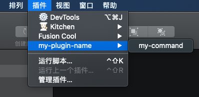
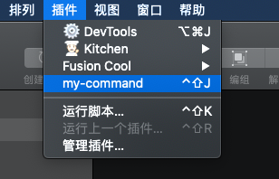

Sketch 插件可以通过 [JS API](https://developer.sketch.com/plugins/javascript-api) 和 [OC](https://developer.sketch.com/plugins/internal-api) 来实现，OC 比较深入 Sketch 的内部用法，但是当发布新版 Sketch 时会对 API 有较大的修改，且官网比较推荐使用 JS API，所以本文也就主要介绍 JS API 写插件的方法。

<!--more-->

Sketch 插件提供使用 webview 的方式来丰富页面元素和交互形式，所以可以使用 webview 的形式来编写插件。

## 生成插件

可以使用 [skpm](https://github.com/skpm/skpm) 来创建一个 Sketch 插件：

```bash
npm install -g skpm
skpm create my-plugin-name  --template=skpm/with-webview
```

`skpm create <project-name> --template=<username>/<repository>` 是以 `<username>/<repository>` 为模板来创建这个插件（意思是也可以指定 github 上面别人写的开源模板！）。所以现在是以 [sketch-module-web-view](https://github.com/skpm/sketch-module-web-view) 为模板创建。

创建完文件结构大致是：

```
- assets  // 静态资源
  - icon.png
- resources // webview内嵌页面
  - style.css
  - webview.html
  - webview.js
- my-plugin-name.sketchplugin // build 出的 sketch 插件
  - Resources
  - Sketch
- src // 具体文件
  - manifest.json
  - my-command.js
- package.json
- webpack.skpm.config.js
```

## 编写插件

当这个时候双击 .sketchplugin 文件时，会看到目前的插件是这样的：



### 目录项配置

manifest.json 文件是插件的配置入口，默认内容如下：

```json
{
  "compatibleVersion": 3, // 定义 sketch 需要运行该插件的最低版本，例如 "compatibleVersion": 52.1
  "bundleVersion": 1,
  // commands 是一个对象数组，包含所有需要的 command
  "commands": [
    {
      "name": "my-command", // command 对应的名字
      "identifier": "my-plugin-name.my-command-identifier", // command 对应的唯一标识
      "script": "./my-command.js", // command 对应的 script 文件
      // "shortcut": "ctrl shift j", // command 对应的快捷键
      // command 对应的具体 action
      "handlers": {
        "run": "onRun",
        "actions": {
          "Shutdown": "onShutdown"
        }
      }
    }
  ],
  // 定义插件的操作目录布局
  "menu": {
    // "isRoot": true, // 插件默认会有一个子目录，如果不需要子目录就可以在根目录上设置 isRoot: true
    "title": "my-plugin-name", // 当 isRoot 设置为 true，会被忽略
    "items": ["my-plugin-name.my-command-identifier"]
  }
}
```

当给插件配置完 `isRoot` 和快捷键之后，会发现插件变成如下：



这只是针对单个目录的简单插件，如果插件命令较多，并且需要子目录，则需要在 `commands` 数组中增加相应的配置，同时将 `identifier` 加到 menu 项的 items 中即可。更多 `manifest` 配置可见[官网文档](https://developer.sketch.com/plugins/plugin-manifest)。

### actions

action 是由于用户交互在应用程序中发生的事件，例如`OpenDocument`、`CloseDocument`等，当触发这些 action 时，就可以运行插件中的某些代码。

例如：

```json
// manifest.json
"commands": [{
  "script" : "my-action-listener.js",
  "name" : "My Action Listener",
  "handlers": {
    "actions": {
      "OpenDocument": "onOpenDocument"
    }
  },
}]
```

```js
// my-action-listener.js
export function onOpenDocument(context) {
  context.actionContext.document.showMessage("Document Opened");
}
```

具体的 action 会触发的方法需要在顶层 export 出去。

这里的 `context` 是关于当前 action 所涉及到的一些信息，信息放在 `context.actionContext` 对象中（并不是所有 action 都具备一个`actionContext`属性，需要的话可以给官网提 issue）。比如当选择图层时，`actionContext` 就是选中的图层，例如[selectionChanged](https://developer.sketch.com/reference/action/selectionchanged/)。

有很多 action 是有 `begin/finish` 两个的，例如 `selectionChanged`，就有 `SelectionChanged.begin` 和 `SelectionChanged.finish`两个。如果不具体标识出来是 `begin` 还是 `finish` 而直接写 `selectionChanged` 就会触发两次。

更多 `action` 可以见[文档](https://developer.sketch.com/plugins/actions)。

### webview

当使用 `skpm create my-plugin-name --template=skpm/with-webview` 创建插件时，我们会看到 my-command.js 中存在一个 webview 示例：

```js
import BrowserWindow from "sketch-module-web-view";

const webviewIdentifier = "my-plugin-name.webview"; // 一个独特标识

export default function () {
  const options = {
    identifier: webviewIdentifier,
    width: 240,
    height: 180,
    show: false,
  };

  const browserWindow = new BrowserWindow(options); // 创建一个 webview

  browserWindow.once("ready-to-show", () => {
    // webview 的事件和方法具体可见： https://github.com/skpm/sketch-module-web-view/blob/master/docs/browser-window.md
    browserWindow.show();
  });

  browserWindow.loadURL(require("../resources/webview.html")); // 加载本地的 html，也可以加载远程的 html，就可以使用服务器上现成的页面~
}
```

然后可以通过 `const webContents = browserWindow.webContents` 获取到 `wenContent`，与页面进行通信：

```js
// my-command.js
import UI from "sketch/ui";
// ...
const webContents = browserWindow.webContents;

// webContent 的事件具体可见：https://github.com/skpm/sketch-module-web-view/blob/master/docs/web-contents.md
webContents.on("did-finish-load", () => {
  UI.message("UI loaded!");
});

// 通信，监听页面上触发的 `nativeLog`，随后执行页面上的 `setRandomNumber` 方法
webContents.on("nativeLog", (s) => {
  UI.message(s);
  webContents
    .executeJavaScript(`setRandomNumber(${Math.random()})`)
    .catch(console.error);
});

...
// 页面上的方法，webview.js
// 使用 `window.postMessage` 触发 `nativeLog`
document.getElementById("button").addEventListener("click", () => {
  window.postMessage("nativeLog", "Called from the webview");
});

// 暴露出去的 `setRandomNumber` 方法
window.setRandomNumber = (randomNumber) => {
  document.getElementById("answer").innerHTML =
    "Random number from the plugin: " + randomNumber;
};
```

大致通信方式如下图：


更多的关于通信的细节可见[文档](https://github.com/skpm/sketch-module-web-view/blob/master/docs/communication-plugin-webview.md)。

## 发布插件

其实最简单的插件发布方式就是修改当前 version 打包个 .zip，如果是在 github 上的话可以直接使用 skpm 内置的构建命令以及发布。

```json
"postinstall": "npm run build && skpm-link"
```

如果需要自己定义如何发布的话，就可以在 manifest.json 中添加一个 `"appcast"` 字段，这个字段的值是一个 xml 链接，例如 kitchen 的 appcast.xml

```json
"appcast": "https://kitchen.alipay.com/appcast.xml",
```

打开之后会发现是一个个 `<item>` 的集合：

```xml
<item>
  <enclosure url="https://gw.alipayobjects.com/os/kitchen/e80d9df7-d0cc-4420-8738-7ed0de147b55/kitchen-2.3.1.zip" sparkle:version="2.3.1"/>
</item>
```

可以看出每个 item 下面都有每个版本的具体包的地址，当给 xml 添加完新版本的 item 后，Sketch 会根据 xml 链接获取是否有新的版本，随后就会显示有新的版本需要更新。

这里需要注意，xml 链接需要是 https 协议！更多关于如何发布插件可见[文档](https://developer.sketch.com/plugins/publish-a-plugin)。

## 一些额外配置

- 崩溃保护：当 Sketch 运行发生崩溃，它会启用安全模式而停用所有插件。意味着当因为 bug 导致 Sketch 崩溃后，需要重启 Sketch 后重新启用插件，此时可以禁用安全模式来避免这一操作。

```bash
defaults write com.bohemiancoding.sketch3 disableAutomaticSafeMode YES
```

- 插件缓存：默认 Sketch 会缓存插件，意味着本地用 `npm run watch` 对插件进行修改之后即便插件重新 build 了 Sketch 也不会重新加载该插件（就需要重启 Sketch），此时可以配置禁用缓存机制。

```bash
defaults write com.bohemiancoding.sketch3 AlwaysReloadScript -bool YES
```

- 插件 WebView 调试：可通过以下配置开启 webview 调试功能。

```bash
defaults write com.bohemiancoding.sketch3 WebKitDeveloperExtras -bool YES
```
